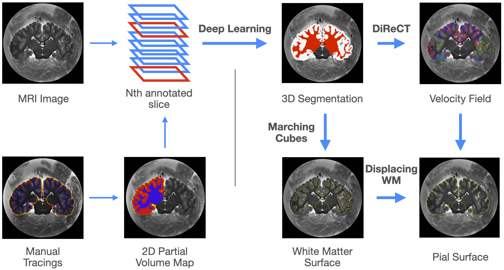

# Few-Shot Cortical Reconstruction

author: Timo Blattner

## About

Here is the code for our few-shot surface reconstruction method



## Installation

For installation we recommend to create an environment with python -m venv or conda create, dependencies are then installed using pip 
```
pip install -r requirements.txt
```

## Usage

Our 3 steps are divided into 3 notebooks, and contain explanations on how to run them, but broadly: 

1. pre-processing: we binarize the tracings to generate a ground truth for the model to learn from
2. model.ipynb: the model learns from the examples to label the whole image
3. post-processing: from the segmentation and the probability map, a surface is generated by the use of DiReCT velocity fields

In theory, each component can be run-seperately, and the framework is flexible. 